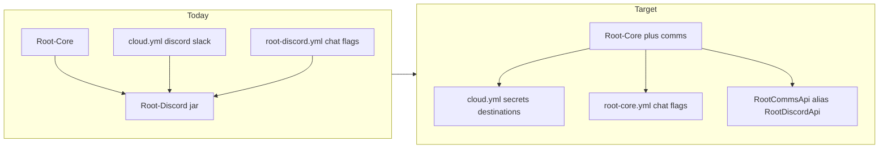

# Migrate Root-Discord → Root-Core (comms rebrand)

**Status:** Implemented in Root-Core 1.7.6 — retire `root-discord-*.jar` on handoffs.  
**Goal:** Absorb the Paper Discord/Slack bridge into **Root-Core** so Slack + Discord settings live in Core-owned YAML (`cloud.yml` + `root-core.yml`), retire the separate `Root-Discord` jar, and keep a stable API for RootMC / Official consumers.

## Verdict

Merge [`plugins/root-discord`](Plugin Building/Minecraft/plugins/root-discord) into [`plugins/root-core`](Plugin Building/Minecraft/plugins/root-core) as a **comms** package (JDA chat bridge + Slack Incoming Webhook log uploads). Keep secrets in [`cloud.yml`](Plugin Building/Minecraft/plugins/root-core/src/main/resources/cloud.yml) (`discord.*` / `slack.*`). Move chat behavior flags from `root-discord.yml` into **`root-core.yml`**. Remove `root-discord-*.jar` from Claims / Towny / Test after cutover.



## Why

- Root-Discord already **hard-depends** Root-Core and only owns ~5 Java classes + JDA shade.
- `cloud.yml` already holds Discord/Slack secrets; splitting chat flags into `root-discord.yml` forces a second plugin identity for configuration that operators expect “in Core.”
- Slack server-logs + Discord chat are **server connectivity**, same spine as license/cloud — fits Core’s “central connection” role.
- One less jar on handoffs; one `/rootcore` admin surface for reload/status of comms.

## Non-goals (v1)

- Changing Discord guild/channel IDs or Slack webhook URLs (keys stay; values unchanged).
- Moving Worker/API Discord posts into Paper (wrangler `DISCORD_ROOTMC_*` stays Worker-owned).
- Rewriting JDA or Slack clients from scratch (move + rename packages).
- Merging unrelated suite plugins.

## Config model (Core YAML)

### Keep in `plugins/RootMC/cloud.yml` (secrets + destinations)

Already present — no key rename required for ops continuity:

```yaml
discord:
  bot-token: ""
  guild-id: ""
  channels:
    ingame-chat: ""
    server-logs: ""      # legacy fallback
  roles:
    linked: ""
slack:
  server-logs-channel: "C0BMX0QKSTS"
  server-logs-webhook: ""
```

Optional later (document only in v1 comments): `slack.feedback-webhook` if Paper ever posts feedback locally (today feedback is Worker → Slack).

### Move into `plugins/RootMC/root-core.yml`

From today’s `root-discord.yml`:

```yaml
comms:
  discord:
    chat:
      enabled: true
      server-tag: T
      allowed-role-id: ""
      relay-chat: true
      relay-join: true
      relay-leave: true
      relay-death: true
      relay-reachout: true
      inbound-format: "&8▎ &9Discord&8│ &f{user}&8 &7»&f {message}"
  slack:
    server-logs:
      enabled: true   # prefer webhook when set in cloud.yml
```

**Migration on enable:** if `root-discord.yml` exists and `root-core.yml` `comms` is empty, copy chat flags once and log “migrated root-discord.yml → root-core.yml”; leave old file as `.migrated` backup.

**Legacy fallbacks** (already coded): `rootmc.yml` `discord-chat.*`, `cloud.yml` `discord-chat.*` — keep one release.

## Code merge

### Into Root-Core

| From root-discord | To root-core |
|---|---|
| `DiscordChatBridge` | `...rootcore.comms.DiscordChatBridge` |
| `DiscordChatConfig` | `...rootcore.comms.CommsConfig` (reads cloud + root-core.yml) |
| `SlackServerLogsClient` | `...rootcore.comms.SlackServerLogsClient` |
| `RootDiscordApiImpl` | `...rootcore.comms.RootCommsApiImpl` |
| JDA shade in `build.gradle.kts` | Move shade/relocate into `root-core` |

Enable path in `RootCorePlugin`: after cloud ensure → start comms if `comms.discord.chat.enabled` or slack webhook present.

Commands: extend `/rootcore` with `comms` / `discord` subcommands (`status`, `reload`) — deprecate `/rootdiscord` (optional one-release alias plugin stub **or** soft command registration removed).

### Common API (compatibility)

Prefer **keep** `RootDiscordApi` + `ShadedServiceBridge.resolveDiscord` for one major suite version so RootMC / Official need no logic change:

- Core registers `RootDiscordApi` (implementation still works).
- Add `RootCommsApi extends RootDiscordApi` (or alias typedef) + `RootCommsSupport.PLUGIN_NAME = "Root-Core"`.
- Update `RootDiscordSupport.PLUGIN_NAME` resolution: try Root-Core first, then legacy Root-Discord if present.
- `warnIfMissing` text → “Root-Core (comms)” instead of Root-Discord.

### Retire root-discord module

1. After Core ships with comms: delete or `halted-development/root-discord`.
2. Handoffs: remove `root-discord-*.jar`; bump Core jar.
3. Manifest / wiki / SuiteSpine pack `"Discord" → ["Root-Discord"]` → `"Comms" → []` (bundled in Core) or drop pack.
4. Root-Core `loadbefore`: remove `Root-Discord` entry.
5. RootMC / Official `softdepend`: remove `Root-Discord` (Core already hard-depended).

## Consumer impact

| Plugin | Change |
|---|---|
| `rootmc` | Softdepend drop; `RootDiscordSupport.warnIfMissing` still works via Core registration |
| `rootmc-official` | Same; hourly log relay unchanged |
| Operators | One jar less; edit `root-core.yml` for chat toggles; secrets still `cloud.yml` |

## Delivery phases

1. **Absorb** — move classes + JDA into Core; register `RootDiscordApi`; dual-read `root-discord.yml` and `root-core.yml` `comms`.
2. **Config migrate** — first-boot copy of chat flags; template updates in Core `cloud.yml` / `root-core.yml` comments.
3. **Cutover handoffs** — Claims/Towny/Test: Core bump, delete Discord jar; `/rootcore reload` + chat smoke + Slack log smoke.
4. **Cleanup** — halt/remove module; update wiki, manifest, SuiteSpine, GitHub staging; deprecate `/rootdiscord`.
5. **API polish (optional follow-up)** — rename call sites to `RootCommsApi` / `resolveComms` in a later suite minor.

## Risks

- **JDA size in Core** — Core jar grows; acceptable (already shaded in Discord jar today).
- **Double bot** — if both jars left installed, two JDA sessions; cutover checklist must remove Discord jar first or Core must refuse start when legacy plugin detected.
- **ClassLoader** — Core already shades common; keep excluding duplicate common from JDA shade like Discord does.

## Success criteria

- Single Paper plugin owns Discord chat + Slack server-logs.
- Chat flags editable only via `root-core.yml` (after migrate); secrets only via `cloud.yml`.
- `RootDiscordApi` still resolves for Official hourly logs and RootMC reachout.
- No `root-discord` jar on live handoffs; no double JDA.
- Documented operator steps in Core README + Change Log.

## Out of scope

- Reworking Slack feedback Worker webhook (already on `api.rootmc.net`).
- Renaming Discord channel IDs or Slack channels.
- Building elite root-skills (separate plan).
