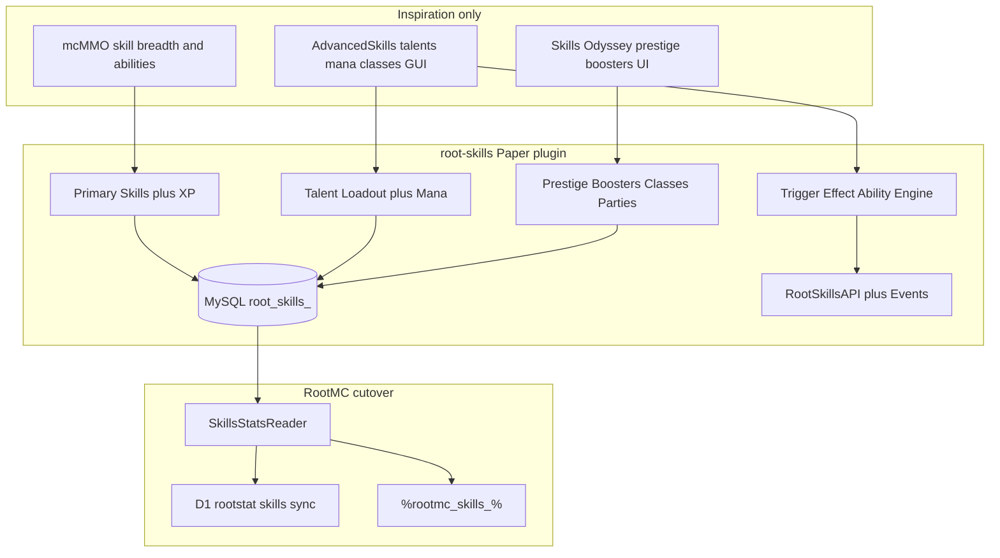
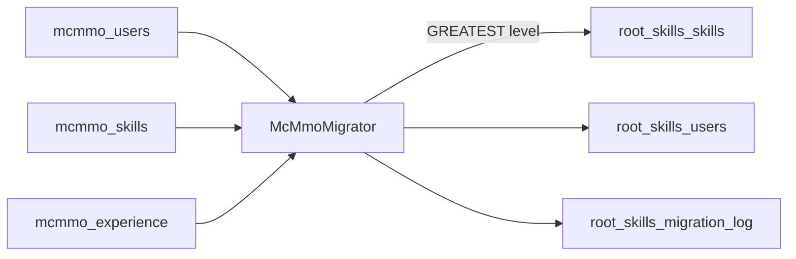

# Elite root-skills (full mcMMO replace)

## Verdict

Build a new Gradle module `[Plugin Building/Minecraft/plugins/root-skills](Plugin Building/Minecraft/plugins/root-skills)` that **owns** XP, abilities, talents, prestige, boosters, parties, MySQL, and GUIs. Remove `mcMMO.jar` from Claims / Towny / Test after migration. Do **not** fork mcMMO (GPL) or copy AdvancedSkills / Prodige’s Skills (ARR) — clean-room design from their public feature docs.




## Feature merge (what “elite” means)


| Layer               | Take from                 | RootMC design                                                                                                                                                                                                                       |
| ------------------- | ------------------------- | ----------------------------------------------------------------------------------------------------------------------------------------------------------------------------------------------------------------------------------- |
| Primary skills      | mcMMO live roster         | Same 19 skills players already know + **Defense** + **Elytra** (AS-style). Salvage/Smelting stay first-class (mcMMO has them; RootMC sync currently ignores them — include them).                                                   |
| Passive abilities   | mcMMO coreskills          | Per-skill active (sneak/right-click) + passive ranks; YAML-tunable, not hardcoded spaghetti                                                                                                                                         |
| Talents             | AdvancedSkills            | Skill-gated unlocks; limited active loadout; **SHIFT+F** open; mana costs; YAML abilities                                                                                                                                           |
| Ability DSL         | AdvancedPlugins Abilities | Root-owned mini-engine: triggers (`MINING`, `ATTACK_MOB`, `FALL_DAMAGE`, …), conditions, effects (`DECREASE_DAMAGE`, particles, sounds, modifiers). Start with ~25 triggers / ~40 effects covering default content; expand via YAML |
| Mana + classes      | AdvancedSkills            | Optional modules on by default for RootMC; class = skill XP multipliers; mana drops on point/level                                                                                                                                  |
| Prestige + boosters | Skills Odyssey            | Per-skill prestige at configured cap (default 100 Retro-scale); permanent buffs; buyable XP/point boosters (Vault/root-economy)                                                                                                     |
| UX                  | AS + Odyssey              | One composition GUI: `/skills` hub, skill detail, talents, prestige, boosters, prefs — not command spam                                                                                                                             |
| Parties             | mcMMO live                | Keep XP share / near-party bonuses; RootMC already has parties on                                                                                                                                                                   |
| Leaderboards        | AS + RootMC cloud         | In-game GUI + existing cloud/Android after sync cutover                                                                                                                                                                             |


**Skill IDs (canonical):**  
`mining`, `woodcutting`, `herbalism`, `excavation`, `fishing`, `repair`, `salvage`, `smelting`, `alchemy`, `taming`, `acrobatics`, `unarmed`, `swords`, `axes`, `archery`, `crossbows`, `tridents`, `maces`, `spears`, `defense`, `elytra`.

**Power level** = sum of primary levels (same idea as today’s `%rootmc_mcmmo_power%`).

## Legal / engineering constraints

- Original Java under RootMC package `com.rootrecord.minecraft.rootskills`.
- Use public *behavior* docs only (mcMMO wiki API shapes as *compatibility inspiration*; AdvancedSkills wiki YAML shapes; Modrinth feature list for prestige/boosters).
- Do not decompile AdvancedSkills or ship Skills Odyssey datapack on Paper hosts.

## Module layout

New plugin under the auto-included Gradle tree (`[settings.gradle.kts](Plugin Building/Minecraft/settings.gradle.kts)`):

```
plugins/root-skills/
  build.gradle.kts          # Hikari/MySQL, Vault, PAPI compileOnly; softdepend root-economy
  src/main/resources/
    plugin.yml              # /skills /talents /class /rootskills admin
    config.yml              # DB, formula Retro-like, feature toggles
    skills/*.yml            # one file per primary skill (XP sources + talents list)
    talents/*.yml
    classes/*.yml
    effects.yml / triggers registry defaults
    messages.yml
  src/main/java/.../rootskills/
    RootSkillsPlugin
    api/                    # RootSkillsAPI, SkillId, events (LevelUp, XpGain, Prestige, TalentActivate)
    model/                  # PlayerSkillsProfile, SkillProgress, TalentState, Party
    storage/                # MySQL schema + migrator from mcmmo_*
    engine/                 # TriggerBus, ConditionEval, EffectRunner, CooldownService
    skills/                 # listeners that emit XP + ability hooks
    talents/ mana/ classes/ prestige/ boosters/ party/
    gui/                    # Adventure menus
    placeholders/           # %rootskills_*% and bridge aliases
```

Mirror a slim public API so RootMC / holograms / future plugins do not hardcode SQL.

## Persistence and migration (mcMMO → root_skills)

All live progression lands in **new** RootMC tables. `mcmmo_*` stays untouched as a rollback backup until cutover is signed off.

### Target schema (`root_skills_` on shared Towny MySQL)

- `root_skills_users` — `uuid` PK, `username`, `class_id`, `mana`, `prefs_json`, `migrated_from` (`mcmmo`|`null`), `migrated_at`, `updated_at`
- `root_skills_skills` — PK `(uuid, skill_id)`, `level`, `xp` (XP **into current level**), `prestige` (0 at migrate), `buffs_json`
- `root_skills_talents` / `root_skills_boosters` / `root_skills_parties` — empty at migrate; talents unlock from migrated levels on first login via unlock rules
- `root_skills_migration_log` — run_id, started/finished, rows_seen, rows_written, conflicts, dry_run flag, checksum

Source (live): `mcmmo_users` + `mcmmo_skills` (+ `mcmmo_experience` if present for partial-level XP). Reader columns already known in [`McMMOStatsReader`](Plugin Building/Minecraft/plugins/rootmc/src/main/java/com/rootrecord/minecraft/rootstat/mysql/McMMOStatsReader.java).

### Progression parity (why levels merge 1:1)

Live Towny mcMMO is **RetroMode on** with this formula from [`experience.yml`](Server Handoffs/2. RootMC - Towny/plugins/mcMMO/experience.yml):

- Curve: `EXPONENTIAL` — `multiplier * level^exponent + base` → `0.12 * level^2.05 + 2800`
- `Cumulative_Curve: true` (power-level-aware XP-to-next — port the same rule so high-power players keep the same grind feel)
- Global XP multiplier `0.42`, plus per-skill multipliers (Mining `0.48`, Herbalism `0.5`, …) copied into `config.yml` / `skills/*.yml` as defaults

**root-skills ships the same curve + Retro display scale as v1 defaults.** Migrated `level` values are therefore meaningful without rescale. Do **not** compress Retro 1–1000 into a 1–100 Odyssey-style cap for existing skills; prestige unlocks at a high Retro threshold (configurable, default e.g. 1000) so current tops don’t auto-prestige on migrate.

### Column → skill_id map (direct, no rescale)

| mcMMO column | root `skill_id` | merge rule |
|---|---|---|
| mining, woodcutting, herbalism, excavation, fishing, repair, unarmed, swords, axes, archery, acrobatics, taming, alchemy, crossbows, tridents, maces, spears | same id | `level = GREATEST(existing, mcmmo)`; XP merge below |
| salvage, smelting | same id | same (include even though RootMC cloud sync ignored them) |
| *(none)* | `defense`, `elytra` | insert `level=0`, `xp=0` for every migrated user |

UUID identity: prefer `mcmmo_users.uuid` (or equivalent); fall back to offline UUID from username only if uuid missing, and log those rows.

### Level / XP merge rules (idempotent)

Admin: `/rootskills migrate mcmmo [--dry-run] [--player <name|uuid>]`

For each `(uuid, skill_id)`:

1. **Read** mcMMO `level` + partial XP (from experience table/columns if available; else `xp=0` at that level).
2. **If no root row:** insert mcMMO level + xp; `prestige=0`.
3. **If root row exists** (re-run or partial play on root-skills before cutover):
   - `level = GREATEST(root.level, mcmmo.level)`
   - If levels equal: `xp = GREATEST(root.xp, mcmmo.xp)`
   - If mcMMO level wins: take mcMMO xp for that level
   - If root level wins: keep root xp (player already progressed past mcMMO on the new plugin)
4. **Never decrease** a root level on migrate (safe re-run).
5. **Talents:** after profile load, unlock any talent whose `required_level <= skill.level`; do not auto-equip.
6. **Parties:** optional v1 skip; or map mcMMO party membership in a later pass (not required for level merge).

Dry-run prints: users scanned, skills written, GREATEST conflicts, missing UUIDs, power_before vs power_after (sum of levels). Apply writes one transaction per batch (e.g. 500 users) with a final checksum vs source row counts.



### Cutover sequence

1. Deploy root-skills on Test pointing at a **DB copy**; dry-run then apply; spot-check high-power players.
2. Deploy on Claims/Towny (shared MySQL); dry-run; apply during low traffic; leave mcMMO jar in place but **disable XP** only if dual-running is needed — preferred: stop mcMMO, migrate, start root-skills so there is never double XP.
3. Keep `mcmmo_*` tables read-only backup for ≥1 wipe cycle.
4. Flatfile Test: convert `flatfile/mcmmo.users` with the same map, or wipe Test and only migrate MySQL players who join Test later.

## XP / ability model (concrete defaults)

- **Formula:** Port live Retro exponential + cumulative curve + global/`Skill_Multiplier` values from Towny `experience.yml` so post-migrate grind ≈ current mcMMO. Talent/prestige layers sit **on top** of that curve, they do not replace it.
- **XP sources:** block break / harvest / combat / fish / brew / tame / fall-survived / craft-repair — gated by Claims/Towny protection softdeps (respect claim flags; no XP in denied regions). Tune per-action XP values toward live `Experience_Values` where practical.
- **Anti-farm:** port live exploit toggles (spawner XP 0, tall-plant limits, tree-feller reduced XP, etc.) into config day one.
- **Active abilities:** tool + sneak/right-click patterns per skill implemented as talent/ability YAML.
- **Prestige:** only after Retro-scale cap (not Odyssey’s raw 100); reset level/xp for that skill, increment prestige, apply permanent buff from `skills/<id>.yml`.
- **Boosters:** timed global or per-skill multipliers via Vault/root-economy.

## RootMC ecosystem cutover

1. **rootmc:** replace `McMMOStatsReader` with `RootSkillsStatsReader` reading `root_skills_`*; keep cloud payload shape (`skills` JSON + `power_level`) so D1/`rootstat_mcmmo_stats` can be renamed later without breaking Android in the same PR — prefer **alias**: sync endpoint accepts `skills` and keeps table name until a follow-up rename to `rootstat_skills_stats`.
2. **PAPI:** `%rootmc_skills_power%`, `%rootmc_skills_<skill>%`; keep `%rootmc_mcmmo_power%` as deprecated alias for one release.
3. **rootmc-official:** disable/remove `sync.datasets.mcmmo` path or retarget to `root_skills_` if peer sync ever needed (today it’s already `false` because MySQL is shared).
4. **roothelp / root-play:** swap `/mcstats` `/mctop` copy to `/skills`.
5. **Realm API:** `[MCMMO_SKILL_KEYS](Web Files/rootmc-realm-api/src/rootstat-minecraft.ts)` extend with `salvage`, `smelting`, `defense`, `elytra`; mysql full-sync prefixes add `root_skills_`.
6. **Handoffs:** remove `mcMMO.jar` + `plugins/mcMMO/`; ship `root-skills.jar` + configs on Claims, Towny, Test.

## Public API (for RootMC + others)

Stable surface inspired by mcMMO’s public helpers (names Root-owned):

- `RootSkillsAPI.getLevel(Player|UUID, SkillId)`  
- `addXp` / `setLevel` / `getPowerLevel`  
- `getMana` / `getClass` / `getPrestige`  
- Events: `RootSkillsXpGainEvent` (cancellable), `RootSkillsLevelUpEvent`, `RootSkillsPrestigeEvent`, `RootSkillsTalentTriggerEvent`  
- Placeholder expansion registration inside the plugin

## Delivery phases

1. **Scaffold + storage + migrator + API stubs** — plugin loads; dry-run/apply mcMMO→`root_skills_*` merge on Test DB copy; verify GREATEST merge + power parity samples.
2. **XP + persistence + hub GUI** — all primary skills grant XP on the **ported Retro curve**; `/skills` shows migrated levels; power readable.
3. **Ability engine + default talents + mana** — YAML content for every skill; SHIFT+F talent menu; talent unlock pass from migrated levels.
4. **Prestige, boosters, classes, parties** — Odyssey/AS meta loop (prestige threshold Retro-scale, not raw 100).
5. **Cutover** — stop mcMMO → migrate shared MySQL → start root-skills; update RootMC/PAPI/cloud; verify holograms + Android leaderboards.
6. **Balance pass** — only tune action XP / talent power; do not rescale migrated levels unless a measured parity bug forces a one-time corrective multiplier (documented + re-merge).

## Out of scope for v1

- Shipping Skills Odyssey datapack  
- Purchasing/bundling AdvancedSkills  
- Full 100+ AdvancedPlugins effects catalog (subset that covers default talents)  
- Hardcore death penalty / vampirism (live mcMMO has these off — keep off)  
- Shrinking Retro levels into a 1–100 scale at migrate

## Success criteria

- Migrated player’s primary skill **levels match mcMMO 1:1** (same integers); partial XP preserved when source has it  
- Re-running migrate never decreases a root level (`GREATEST` merge)  
- Dry-run report: power_before ≈ power_after for sampled top players  
- mcMMO jar absent after cutover; no double XP  
- `/skills` + talents + at least one prestige path work on Test then Claims/Towny  
- Cloud power/leaderboards still populate  
- Claims protection respected for XP and AoE abilities


