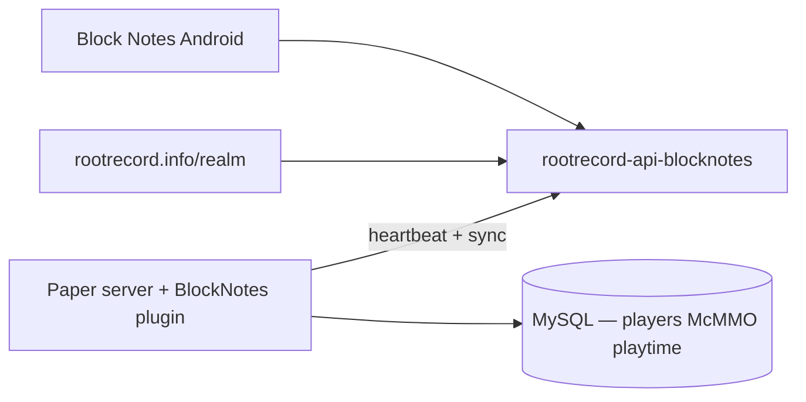

# Minecraft Realm & Paper plugins

Root Record operates a **Realm** web hub and a **unified Paper plugin** that connects the Block Notes Android app to a live Minecraft server (RootRecord SMP).

**Realm hub:** [rootrecord.info/realm/](https://rootrecord.info/realm/)  
**Player verify:** [rootrecord.info/realm/verify](https://rootrecord.info/realm/verify)  
**Server registration:** [rootrecord.info/realm/servers](https://rootrecord.info/realm/servers)

## Architecture



## Production plugin: BlockNotes (unified)

Deploy **one** jar: **`blocknotes-1.1.0-SNAPSHOT.jar`**

It replaces the legacy standalone **RootStat** jar. Both register `/rootstat` — do not run them together.

| Capability | Commands / behavior |
|------------|---------------------|
| App heartbeat | POST `/api/blocknotes/server/heartbeat` every N minutes |
| Remote jar update | Heartbeat response includes `plugin_updates` URL |
| Account linking | `/rootstat link`, `/rootstat status` |
| Cloud sync | Linked players, McMMO skills, playtime → D1 |
| PlaceholderAPI | `%rootstat_verified%`, `%rootstat_account_id%`, etc. |
| Operator | `/blocknotes status`, `/blocknotes reload` |

Published jar URL (live servers pull via heartbeat):

`https://rootrecord.info/realm/plugins/blocknotes-1.1.0-SNAPSHOT.jar`

## Server config layout

All Root Record plugins share **`plugins/RootRecord/`** on the Paper server:

| File | Purpose |
|------|---------|
| `cloud.yml` | **Shared** `server-id` + `server-secret` (from Realm server registration) |
| `blocknotes.yml` | Server address, world name, MySQL, heartbeat/sync intervals, messages |
| `rootstat.yml` | Used only if running standalone RootStat (optional) |

## Build (MonoRepo)

Source: `Minecraft/` — Paper **26.1.2**, Java **25** toolchain.

```powershell
cd Minecraft
.\build-with-server-jdk.bat :plugins:blocknotes:build
```

Output: `Minecraft/out/blocknotes-1.1.0-SNAPSHOT.jar` (auto-copied to `server/plugins/` on build).

Gradle runs on **JDK 17+**; plugin bytecode targets **Java 25** via `gradle.properties` toolchain paths.

## Optional: standalone RootStat

`Minecraft/plugins/rootstat/` builds a linking-only jar for servers that do not run BlockNotes. Same `cloud.yml` + `rootstat.yml` layout.

## Featured SMP defaults

| Field | Value |
|-------|-------|
| Address | `15.204.13.9:25565` |
| World | RootRecord SMP |
| Game version | 26.1 |

The app’s Featured Servers screen reads live metadata from the BlockNotes API when the plugin heartbeat is active.

## Related reading

- [blocknotes.md](blocknotes.md) — Android app
- [../06-development/build-minecraft-plugins.md](../06-development/build-minecraft-plugins.md)
- [../03-platform/domains-and-urls.md](../03-platform/domains-and-urls.md)
