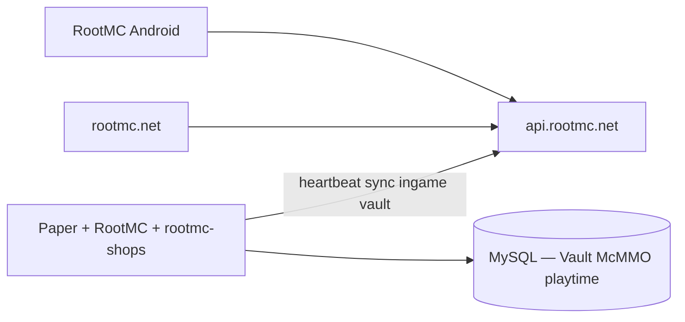

# Minecraft Realm & RootMC (Paper)

Root Record operates the **Realm** web hub and **RootMC** — a public Paper survival server — plus two in-house plugins that connect the **RootMC** Android app (`com.rootrecord.rootmc`) to live gameplay.

| Surface | URL |
|---------|-----|
| RootMC site | [rootmc.net](https://rootmc.net/) |
| **RootMC wiki** | [rootmc.net/wiki/player/](https://rootmc.net/wiki/player/) |
| Player verify | [rootmc.net/verify](https://rootmc.net/verify) |
| Root Shops / market | [rootmc.net/shops/](https://rootmc.net/shops/) · [rootmc.net/market/](https://rootmc.net/market/) |
| **API** | [api.rootmc.net](https://api.rootmc.net/) (`rootmc-api` Worker) |
| RootMC Discord | https://discord.gg/rFFQYrNaqS (guild `1516108585740800042`) |

## Architecture



## Production plugins

Deploy these Root Record jars on RootMC:

| Jar | Role |
|-----|------|
| `rootmc-1.3.13.jar` | Account linking, McMMO/economy sync, in-game capture, heartbeat, Discord chat bridge |
| `rootmc-shops-1.3.14.jar` | Chest shops, `/buy`, price caps, Vault gold |
| `root-loans-1.0.0.jar` | Personal loans — `/loan`, income sweep, gold-ore repayment (community-enabled) |
| `root-contracts-1.0.0.jar` | Player job escrow — `/contract offer|accept|complete|cancel|list` |
| `roothelp-1.0.7.jar` | `/rules`, `/cmds`, `/discord`, `/feedback` — includes loans + contracts in `/cmds` |

Also on the host: **Root-Essentials**, **Root-Rewards**, **Root-Admin**, **Root-Announcer**, Towny, mcMMO, Vault, etc. See [`plugins/README.md`](../../Minecraft/plugins/README.md).

Legacy **BlockNotes** jar and **`rootrecord-api-blocknotes`** Worker are retired — use **`rootmc`** plugin + **`api.rootmc.net`** (`/api/rootmc/*`).

Legacy standalone **RootStat** is merged into RootMC — do not run a separate RootStat jar.

### Command summary (see wiki for full tables)

| Plugin | Commands | Aliases |
|--------|----------|---------|
| RootMC in-game | `/rootmc link`, `waypoint`, `note`, `notes`, `waypoints`, `vault` | `/rmc` |
| Account / sync | `/rootmc link`, `status`, `shops`, `sync`, `reload` | `/bn`, `/rootmcapp`, `/rootstat`, `/rrlink`, `/rootrecord` |
| Shops | `/buy <item> [amount]`, `/rootshops create\|remove\|avg\|reload` | `/rshops` |
| Loans | `/loan take\|info\|repay\|list`, `/rootloans reload` | — |
| Contracts | `/contract offer\|accept\|complete\|cancel\|list`, `/rootcontracts reload` | — |
| Discord bot | `/help`, `/server`, `/proposal` | RootMC Discord guild only |

**App (RootMC Android 1.0.27+):** shop price alerts (`GET/POST/PATCH/DELETE /api/rootmc/shop-alerts`), mayor dashboard (`GET /api/rootmc/towny/me`), FCM via `POST /api/me/push-token` + `FCM_SERVICE_ACCOUNT_JSON` on `rootmc-api`.

Gameplay stack: **EssentialsX**, **Towny** (no daily taxes), **mcMMO**, **Vault**, **PlaceholderAPI**, **BlueMap**. QuickShop may remain read-only during shop cutover.

Published jar URLs (heartbeat auto-update):

- `https://rootmc.net/plugins/rootmc-1.3.13.jar`
- `https://rootmc.net/plugins/rootmc-shops-1.3.14.jar`

## Cloud API (`/api/rootmc/*`)

| Legacy (removed) | Current |
|------------------|---------|
| `POST /api/blocknotes/server/heartbeat` | `POST /api/rootmc/server/heartbeat` |
| `GET /api/blocknotes/server/config` | `GET /api/rootmc/server/config` |
| `GET /api/blocknotes/server/{id}/shops` | `GET /api/rootmc/server/{id}/shops` |
| `POST /api/blocknotes/ingame-events` | `POST /api/rootmc/ingame-events` |
| `GET /api/blocknotes/stock-market` | `GET /api/rootmc/stock-market` |
| `POST /api/blocknotes/towny/sync` | `POST /api/rootmc/towny/sync` |

Legacy `/api/blocknotes/*` requests are rewritten to `/api/rootmc/*` on `api.rootmc.net` during cutover.

## Server config layout

All Root Record plugins share **`plugins/RootRecord/`** on the Paper server:

| File | Purpose |
|------|---------|
| `cloud.yml` | **Shared** `server-id` + `server-secret` (from Realm server registration) |
| `rootmc.yml` | Server address, world name, MySQL, heartbeat/sync, economy, ingame capture |
| `rootmc-shops.yml` | Price cap % (must match rootmc economy) |
| `root-loans.yml` | Loan interest, limits, income sweep, gold-ore repayment |

## Build (MonoRepo)

```powershell
cd Minecraft
.\build-with-server-jdk.bat publishPlugins
```

Output: `Minecraft/out/`, `Desktop/RootMC/plugins/`, `Web/apps/rootmc-web/public/plugins/`.

## LuckPerms (live)

Current rank model:

- `default` (base player)
- `pro` (monthly donor; RootRecord `pro_unlocked`)
- `lifetime` (lifetime donor; RootRecord `life_member`)
- `admin` (staff moderator, non-OP)

Track: `donor` -> `default` -> `pro` -> `lifetime`.

Applied permission source of truth:
- `Minecraft/server/config-templates/luckperms-setup.commands`

Essentials homes:
- `default`: 3
- `pro`: 5
- `lifetime`: 8

See [../06-development/build-minecraft-plugins.md](../06-development/build-minecraft-plugins.md).

## RootMC SMP defaults

| Field | Value |
|-------|-------|
| Address | Announced at launch (hidden pre-release) |
| World | RootMC |
| Game version | 26.1 |
| Map | BlueMap — URL at launch |

The RootMC app tab reads live metadata from the RootMC API when the plugin heartbeat is active.

## Related reading

- [rootmc.md](rootmc.md) — RootMC Android app
- [../06-development/build-minecraft-plugins.md](../06-development/build-minecraft-plugins.md)
- Public wiki: [rootmc.net/wiki/](https://rootmc.net/wiki/)
